# Café Queue Simulation

---

## Overview

A discrete-probability model and simulation of a café queue in R. Customers arrive per 5-minute slot, pick from a 7-item menu, and wait for geometric service times. Two servers are always active and a third server activates when the queue grows past a threshold `h`. The notebook builds the model from first principles: a Banach-matchbox warm-up, the Poisson/categorical/geometric building blocks, menu-aware sampling, per-item bottleneck analysis, a single FIFO simulator reused everywhere, and sensitivity maps over arrival rate `λ` and threshold `h`.

All randomness uses seed `9248` for full reproducibility.

---

## Project Structure

```
.
├── Cafe_Queue_Simulation.ipynb   # Full implementation notebook (executed, seed 9248)
├── results/                      # Generated figures (PNG) and summary tables (CSV)
├── README.md
├── LICENSE
└── .gitignore
```

No external dataset is needed: every arrival, menu pick, and service time is simulated inside the notebook.

---

## Model

- Time slot = 5 minutes, indexed `t = 0, 1, 2, …`; queue after slot `t` is `Q_t` with `Q_0 = 0`.
- Arrivals `Z_t ~ Poisson(λ)`, base `λ = 0.8` per slot; longer windows rescale as `λ_t = λ · t/5`.
- Each arrival picks a menu item from a categorical distribution with probabilities `q`:

| Item | q |
| --- | --- |
| Coffee | 0.25 |
| Cake | 0.15 |
| Smoothie | 0.15 |
| Shake | 0.10 |
| Sandwich | 0.10 |
| Tea | 0.15 |
| Ice Cream | 0.10 |

- Service time for item `i` is `T_i ~ Geom(p_i)` on `{1, 2, …}` with `P(T_i = k) = (1 - p_i)^(k-1) · p_i`, `E[T_i] = 1/p_i`, `Var(T_i) = (1 - p_i)/p_i²`. Per-slot success probabilities:

| Item | p | E[T] (slots) |
| --- | --- | --- |
| Coffee | 0.40 | 2.50 |
| Cake | 0.35 | 2.86 |
| Smoothie | 0.30 | 3.33 |
| Shake | 0.35 | 2.86 |
| Sandwich | 0.25 | 4.00 |
| Tea | 0.35 | 2.86 |
| Ice Cream | 0.30 | 3.33 |

- Servers: 2 always active; a 3rd activates in slot `t` when `Q_{t-1} - 2 >= h` (default `h = 4`). Each active server attempts the head-of-line customer once per slot with that customer's `p_i`; failures stay in place (FIFO, no rotation).

### Theoretical Background

#### Poisson arrivals
`P(Z = k) = e^(-λ) λ^k / k!` with `E[Z] = Var(Z) = λ`. At `λ = 0.8`, `P(Z = 0) ≈ 0.449`, `P(Z ≤ 2) ≈ 0.953`.

#### Categorical menu choice
Each customer independently selects item `i` with probability `q_i`. Over `N` arrivals the counts are multinomial with proportions converging to `q`.

#### Geometric service and the negative binomial
Each slot is a fresh Bernoulli(`p_i`) trial (memorylessness), so trials-until-first-success is geometric — the `r = 1` special case of the negative binomial. Mixture mean service time is `E[S] = Σ q_i / p_i ≈ 3.00` slots, giving offered load `ρ ≈ λ · 3.00 / 2 ≈ 1.20 > 1` at base load on two servers: the café depends on the third server.

#### Banach matchbox warm-up
Two boxes start at `(n, n)`; each step removes a match from a random box. Stopping at `τ = min{t : a box is empty}` with `K` left in the other box gives, for `k = 1, …, n`:

```math
P(K = k) = 2 · C(2n-k-1, n-1) · (1/2)^(2n-k)
```

and `P(K = 0) = 0` (reaching `(0, 0)` needs `2n` draws, but the walk always stops within `2n - 1`). So the model assigns `P(K = 0) = 0` by construction.

---

## Analyses and Results

### Warm-up: Banach matchbox (n = 10, 100,000 walks)

Theory and simulation agree; `K = 0` never occurs:

| k | Analytical | Simulated |
| --- | --- | --- |
| 1 | 0.18547 | 0.18533 |
| 2 | 0.18547 | 0.18376 |
| 3 | 0.17456 | 0.17524 |
| 4 | 0.15274 | 0.15358 |
| 5 | 0.12219 | 0.12259 |
| 10 | 0.00195 | 0.00192 |

<div align="center">

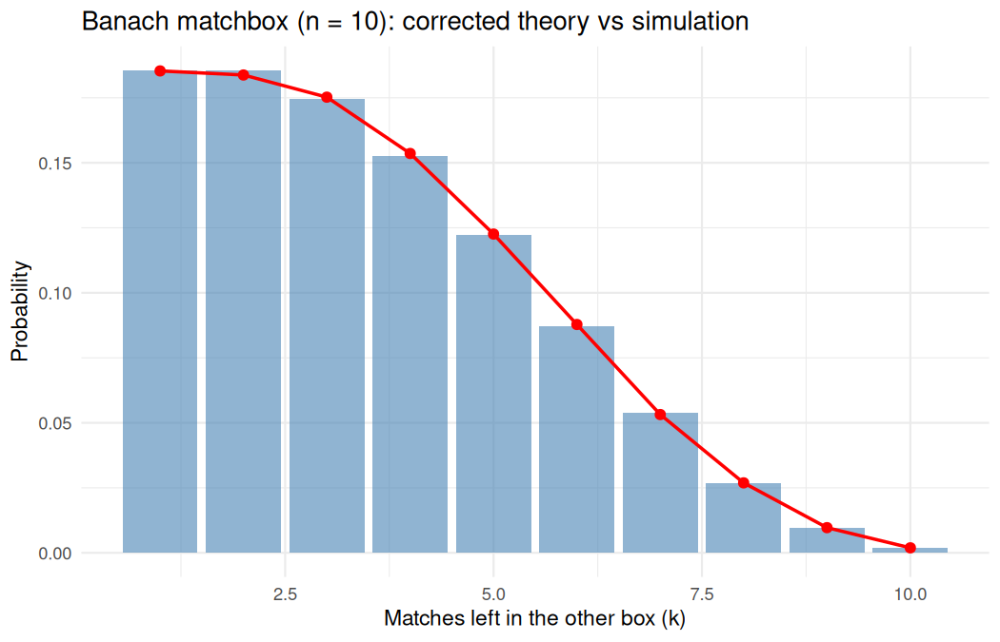

</div>

### Building blocks and sampling (N = 2000)

Poisson draws reproduce `E ≈ Var ≈ 0.8` (observed mean `0.78`, var `0.81`); menu shares land within ~1pp of `q`; per-item geometric histograms/boxplots/ECDFs show Sandwich trailing Coffee everywhere.

<div align="center">

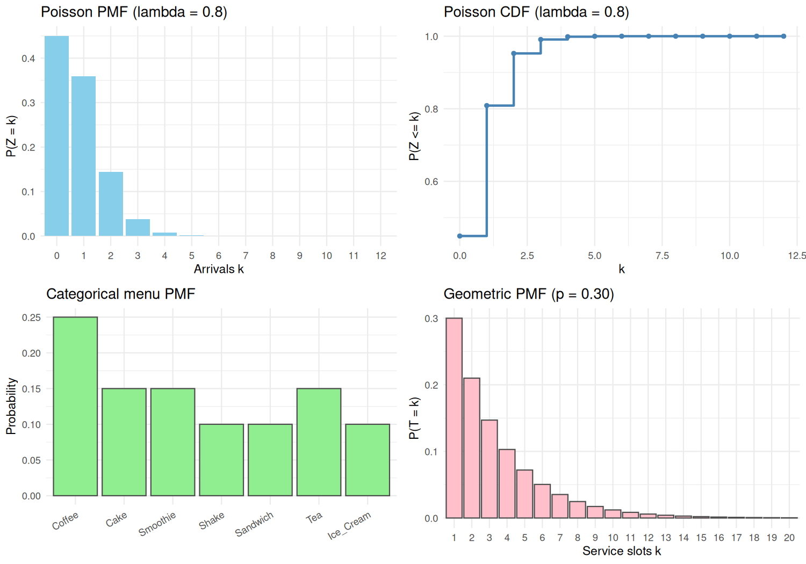

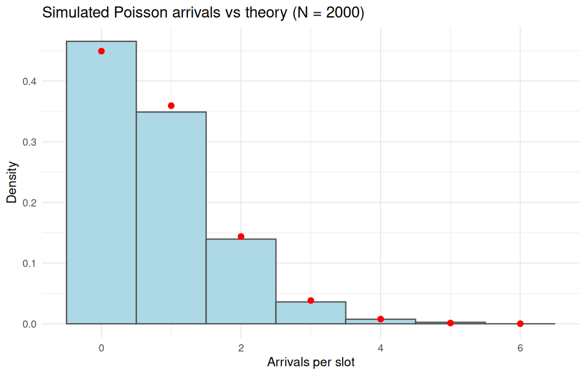

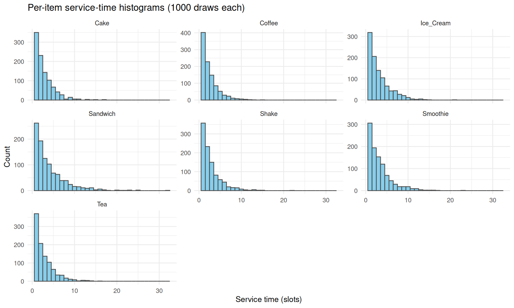

</div>

### Bottleneck

Sandwich (`E = 4.00`, `Var = 12.00`) is the bottleneck, then Smoothie/Ice Cream (`3.33`), then Cake/Shake/Tea (`2.86`); Coffee (`2.50`) is fastest.

<div align="center">

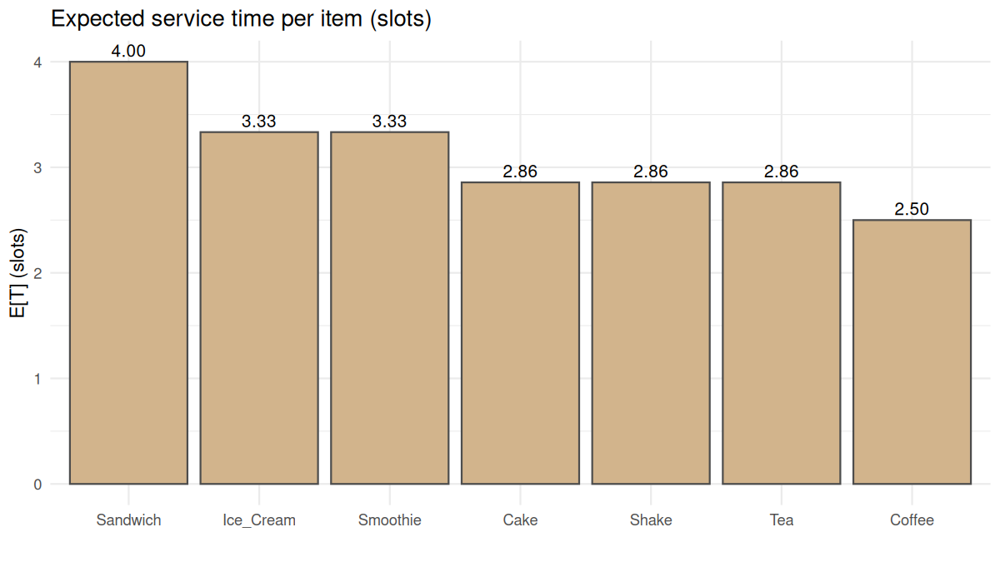

</div>

### Load scenarios (2000 slots, h = 4)

| Scenario (λ) | E[Q] | Var(Q) | P(Q=0) | P(third) |
| --- | --- | --- | --- | --- |
| Low (0.4) | 1.25 | 1.83 | 0.374 | 0.011 |
| Base (0.8) | 5.08 | 15.61 | 0.063 | 0.438 |
| High (1.5) | 510.13 | 86782.38 | 0.001 | 0.998 |

<div align="center">

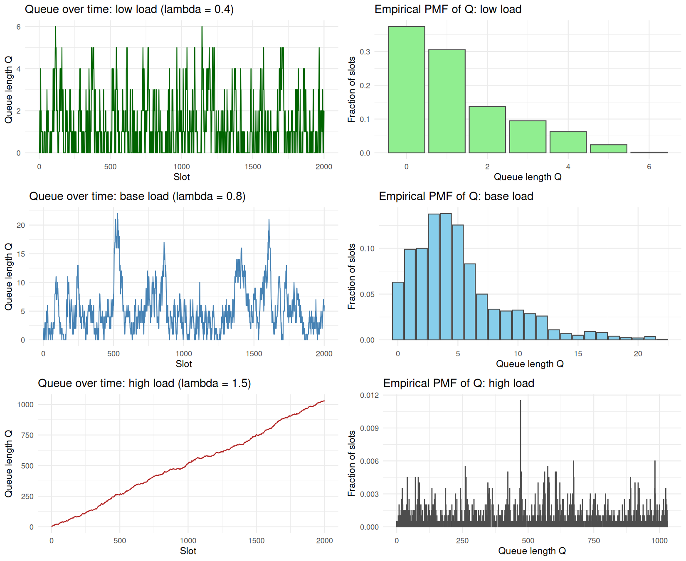

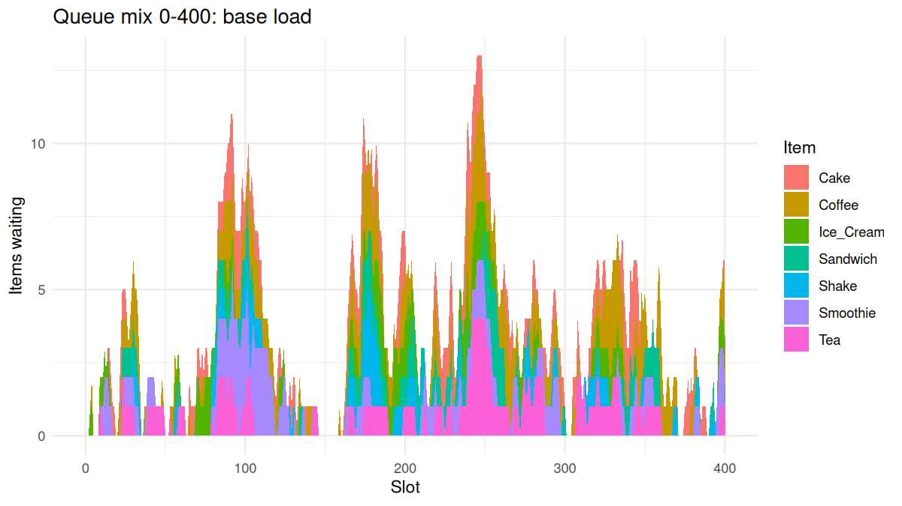

</div>

### Arrival-rate sensitivity (λ = 0.2–1.5)

Stable through `λ = 0.5` (`E[Q] = 1.74`), breaks at `λ = 0.6` (`E[Q] = 2.77 ≥ 2.4` heuristic line); matches `ρ` crossing 1 near `λ ≈ 0.6`. The `E[Q] < 2.4` line is a visualization heuristic, not a formal proof.

<div align="center">

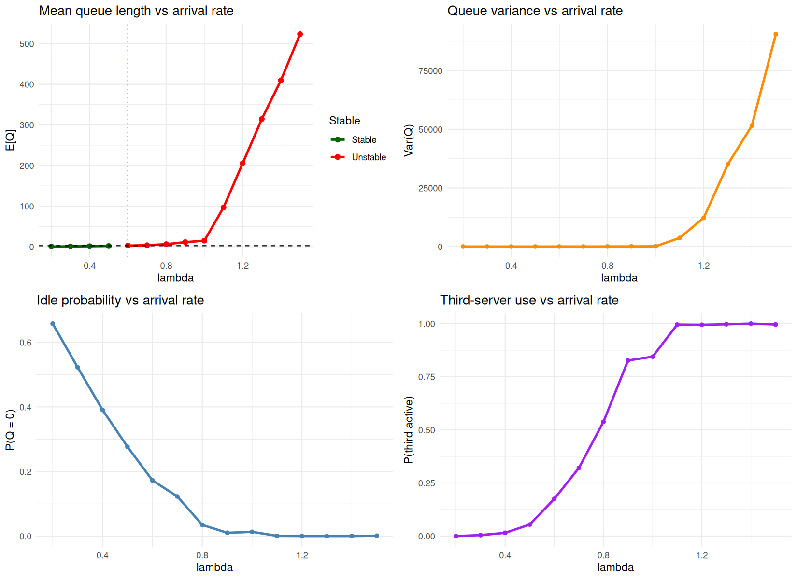

</div>

### Threshold sensitivity (h = 1–8 at λ = 0.8)

All `h` stay above the heuristic line at base load (`E[Q]` from `3.25` at `h = 1` to `8.34` at `h = 8`); earlier help trims the queue but costs staffing (`P(third)` `0.36–0.61`).

<div align="center">

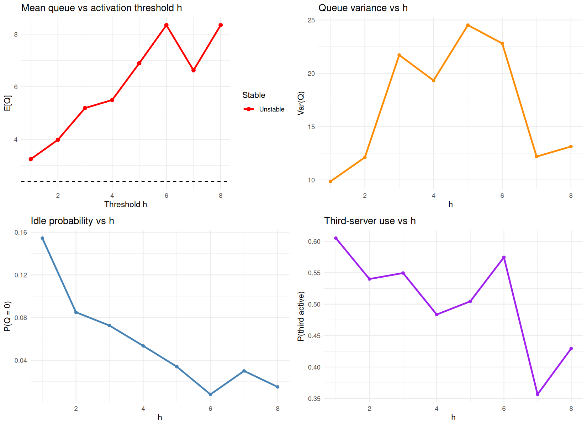

</div>

### Joint λ–h map (1000 slots/cell)

Arrival rate decides the regime (`λ ≤ 0.4` stable for all `h`; `λ ≥ 0.8` unstable everywhere here); `h` only softens the level within a row.

<div align="center">

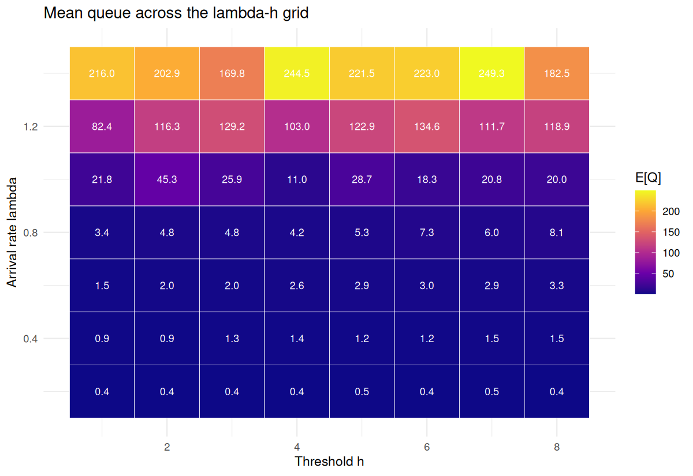

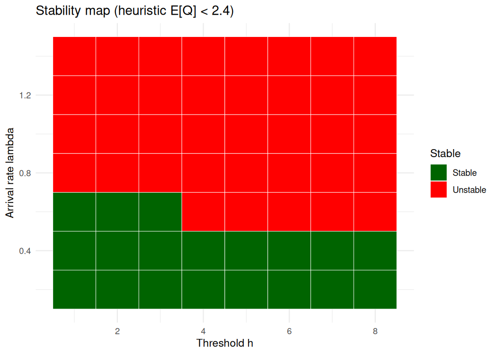

</div>

---

## Requirements

```
R (>= 4.3)
ggplot2, dplyr, tidyr, gridExtra, knitr
```

Install in R:

```r
install.packages(c("ggplot2", "dplyr", "tidyr", "gridExtra", "knitr"))
```

Jupyter with an R kernel (`IRkernel`) is needed to run the `.ipynb` directly; the same code runs as plain R scripts.

## Running the Notebook

```bash
jupyter notebook Cafe_Queue_Simulation.ipynb
```

The notebook creates `results/` automatically, writes all PNG/CSV artifacts, and is committed with outputs embedded (seed `9248`).
